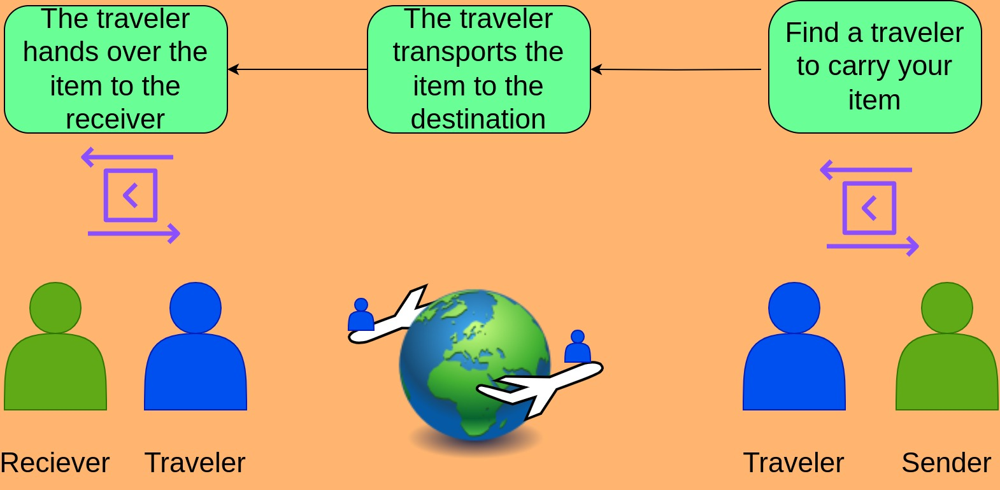

# Bring-Me

Bring-Me is a Spring Boot web application for matching people who need to send items with people who are already traveling that route.




## What It Uses

- Java 21
- Spring Boot
- Spring Security and JWT
- PostgreSQL
- Flyway
- Redis
- Maven
- Docker and Docker Compose

## Project Layout

- `Source/` contains the application code and build files.
- `Docs/` contains diagrams, wireframes, and reference material.
- `Postman_Collections/` contains API request collections.

## Quick Start

```bash
git clone https://github.com/Rockio-sy/Bring-me.git
cd Bring-me/Source
cp .env.example .env
```

Edit `.env` with your local values, then run:

```bash
docker compose up --build
```

The app runs at `http://localhost:8080`.

## Local Development

```bash
cd Source
mvn spring-boot:run -Dspring-boot.run.profiles=dev
```

For the default profile:

```bash
mvn spring-boot:run
```

## Required Environment Variables

Use `.env.example` as the source of truth.

- `SPRING_DATASOURCE_URL`
- `SPRING_DATASOURCE_USERNAME`
- `SPRING_DATASOURCE_PASSWORD`
- `SPRING_DATASOURCE_DB`
- `SPRING_FLYWAY_LOCATIONS`
- `FILE_UPLOAD_DIR`
- `FILE_UPLOAD_TEMP_DIR`
- `JWT_SECRET`
- `EMAIL_HOST`
- `EMAIL_PORT`
- `EMAIL_USERNAME`
- `EMAIL_PASSWORD`
- `SPRING_DATA_REDIS_HOST`
- `SPRING_DATA_REDIS_PORT`

## API Docs

- Swagger UI: `http://localhost:8080/swagger-ui/index.html`
- Main endpoints: see the Postman collections in [`Postman_Collections/`](Postman_Collections)

## Documentation

- Architecture and diagrams: [`Docs/README.md`](Docs/README.md)
- Wireframe preview: [`Docs/Wireframes/Bring-me_exp.jpg`](Docs/Wireframes/Bring-me_exp.jpg)
- Logo asset: [`Docs/Logo/png/logo-no-background.png`](Docs/Logo/png/logo-no-background.png)

## Demo Data

The `dev` profile seeds sample users, trips, items, and requests so the app is easier to inspect after startup.

## Notes For Contributors

- Run the test suite before opening a pull request.
- Keep secrets out of the repository.
- Keep the README and environment sample in sync when you add a new config value.

## Status

This repository is now structured to be easier to understand on GitHub, but it still benefits from more screenshots, CI checks, and release packaging.
